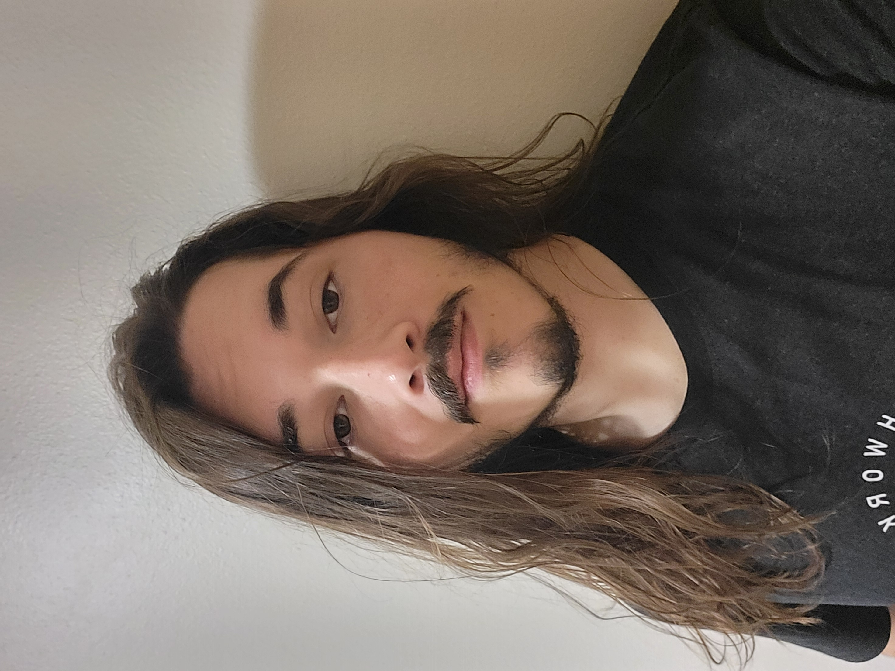
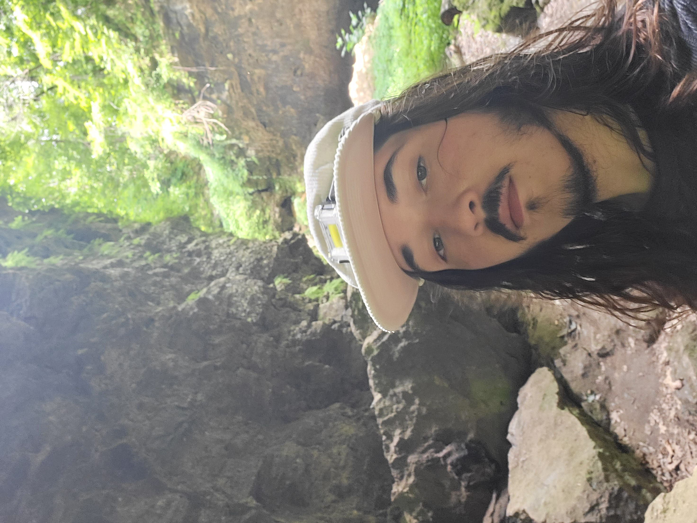

# Seth Klaassen 
Email: sik2004@iastate.edu

Hello and welcome to my portfolio webpage

     

Current Career objectives for me would be to work in a position that involves embedded systems or circuit design. I've enjoyed Product Testing and Product Development roles in the past.

# Projects

## Senior design Project
Project description: A open sourced radio micro-controler on chip for enabling bluetooth at a hobbyist level

My role: analog design team member

Skills learned: Skyworks process, RF comunications, Bluetooth Protocol

Link to documents: since this is the first semester of our senior design there is no link for documents

Big picture contributions: since this is the first semester of our senior design there has not been any big picture accomplishments yet

## Project 1 : Intern Project - DMA Command Pipeline

Project description: to transfer data in a faster maner I was tasked with implementing a DMA transfer protocol. This developed into a buffer that would
send out all data stored within it at high speeds. This also freed up more 
CPU time as DMA is a off CPU component

My role: Lead developer

Skills learned: DMA protocols, Circular buffers, Channel chaining, Optimization levels

Resources used: MMS materials and time.

## Project 2 : Intern Project - Firmware Test Rig

Project description: This project was to create a system that connected a group of testing equipment to a computer through their GPIB ports and automate 
a series of tests in Python using the Robot wrapper for clarity, the goal of which would be to make firmware changes then connect your device to the
system and it would check the functionality of your device to tell if you firmware changes have left it in an unstable state

My role: Lead developer

Skills learned: Python, Robot test wrapper, GPIB communication through ethernet controller

Resources used: Gpib ethernet adapter, MMS materials and time, Wireshark, IDE 3.0, Pic32

## Project 3 : Intern Project - CAN IMU Reformating Gateway (Embedded Controller)

Project description: the John Deere HIL team needed their IMU data over their can lines to be in rts/cts so that their testing environments matched the real
world counterparts. But the machine they were working with did not have this capability. So it was my job to create a controller that would take the data 
from these IMU and pretend to be these IMU's while reformating their data to be in the proper form  

My role: Lead developer

Skills learned: CAN protocol, HIL testing, SIL testing, Harness connection

Resources used: JDemb32, C, HIL, CanSniffer 

# Internships

## Midwest Microwave Solutions

Duties and projects: data collection work, board testing and debugging, discrete filter creation and testing, and DMA transfer protocols

Skills learned: 
- technical: Microscopic soldering, DMA Transfers, RF testing, Altium
- soft: project collaboration, team bonding, 

Evaluations: I was given high praises for my good work, initiative, and drive. I worked on many tasks that covered a lot of the different environments within
the company. My biggest achievement would be the improvements on command speeds through my DMA transfer protocols.

Presentations: My final presentation covered my data collection work, discrete filter creation and testing, and DMA transfer protocols

## John Deere

Duties and projects: HIL Gateway, SIL Updates 

Skills learned:
- technical: Grade 1 Certified on all John Deere Construction Equipment
- soft: Team coordination, Scheduling meetings and managing shared company resources

Evaluations: I was given good marks all around, meeting all expectations and even going above expectations on deliverables. Making sure to deliver
quality solutions that will not create more issues down the line

Presentations: Final Intern Presentation

[Seth Klaassen Resume](images/2025-2026_Klaassen_Resume.pdf)

[General Education Reflection](images/General%20Education%20Reflection.pdf)

[Cumulative Reflection](https://www.youtube.com/watch?v=dQw4w9WgXcQ)

[Ethics term paper from EE 2320](images/Klaassen%20-%20EE%20232%20Ethics%20Term%20Paper.pdf)